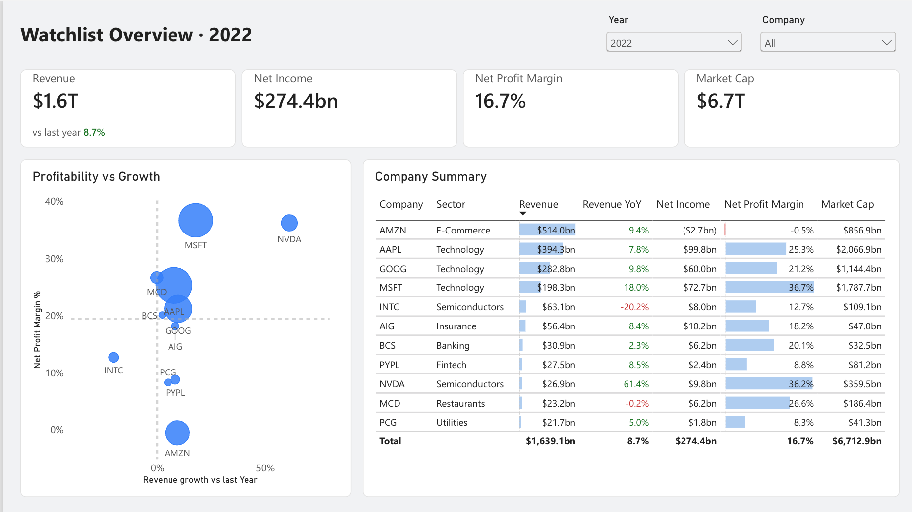
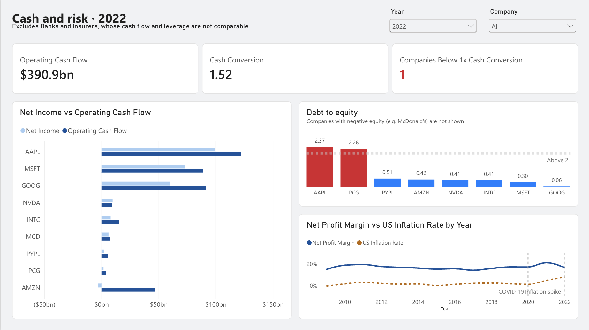
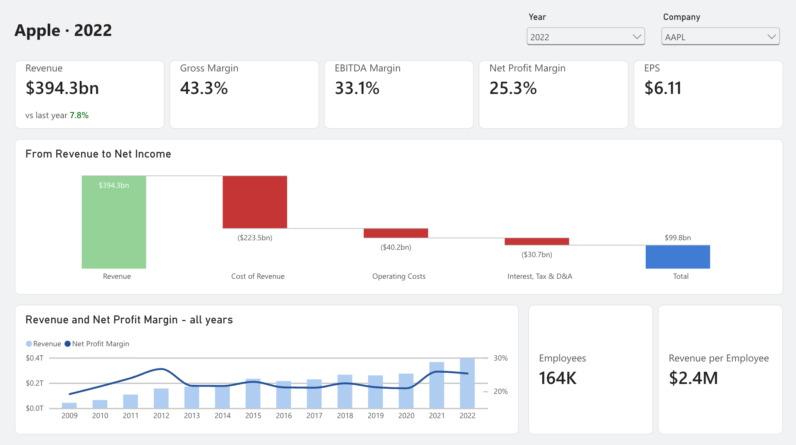
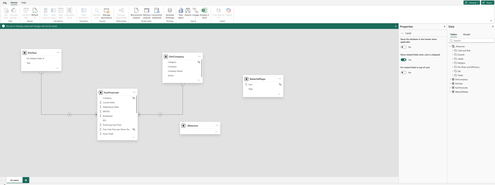

# Financial Statement Analysis (Power BI + Microsoft Fabric)

Profitability, growth, cash quality, and leverage analysis of 12 large public companies, 2009–2022. Built in Power BI, published to a Microsoft Fabric workspace as a semantic model, report, and app.



## Pages

| Page | Question it answers |
|---|---|
| **Overview** | Which companies are biggest, most profitable, and growing? |
| **Cash and risk** | Are profits backed by cash, and how much debt is behind them? |
| **Company deep dive** | How does one company turn revenue into net income? |




## Data

[Financial Statements of Major Companies (2009–2023)](https://www.kaggle.com/datasets/rish59/financial-statements-of-major-companies2009-2023)

161 rows in the source, one per company per year, 23 columns. 159 rows after excluding 2023.

## Model

Star schema built in Power Query from one staging query (load disabled), so every cleaning step is applied once.

- **FactFinancials**: grain = company × year
- **DimCompany**: ticker, company name, corrected sector (via a mapping table)
- **DimYear**: year, US inflation rate



All ratios are DAX measures calculated as ratio of sums (e.g. total net income ÷ total revenue), so totals across companies are correct. The waterfall uses a disconnected steps table and a `SWITCH` measure.

## Data issues and decisions

| Issue | Decision |
|---|---|
| Trailing space in the `Company` header | Trimmed |
| Category labels inconsistent (`Bank` vs `BANK`) and wrong (Sears as Finance, PG&E as Manufacturing, AIG as Bank) | Mapped each company to its actual sector; original label kept, hidden |
| Mixed units: market cap in billions, other values in millions | Converted all money columns to USD |
| Inflation repeated on every company row, and stored as 8.0 rather than 0.08 | Moved to DimYear, divided by 100 |
| PayPal 2014 market cap blank (spun off from eBay in 2015) | Kept as null, not zero |
| Missing years: PayPal starts 2015, Sears ends 2018 (bankruptcy) | Kept. Note: watchlist totals are affected by companies entering and leaving |
| 2023 has data for only 2 of 12 companies | Excluded; analysis covers 2009–2022 |
| Source ratio columns can't be aggregated | Recalculated in DAX; source columns hidden, used only for validation |
| Debt/equity and EPS can't be rebuilt (no total debt or share count) | Shown only for a single company-year, never summed or averaged |
| Negative equity (McDonald's from buybacks, Sears from losses) | Debt/equity returns blank |
| Banks: 100% gross margin (no cost of goods), volatile operating cash flow | Cash and risk page excludes banks and insurers. Barclays alone moved 2020 cash conversion from 1.58 to 2.00 |
| YoY showed −100% when the current year had no data | Growth returns blank unless current-year data exists |
| Net income growth misleading when the prior year was a loss | Divided by the absolute prior-year value |

## Validation

A hidden QA page checks, on every refresh:

- Row count: **159** (161 in the source, less the two 2023 rows)
- Duplicate company-year keys: **0**
- Fact rows without a matching company: **0**
- Net profit margin reconciled to the source column: **146 of 159** within 0.05 percentage points

The 13 exceptions are all **Barclays**, whose figures appear to be converted from GBP. The source margin likely uses different exchange rates or a different net income definition. Report measures use one consistent USD calculation.

## Findings (2022)

- Revenue grew **8.7%** but net income fell **14.1%**, compressing net margin to **16.7%** as inflation peaked at 8.0%.
- Amazon reported a small loss while generating strong operating cash flow: an accounting loss, not a cash problem.
- Nvidia was the only company converting less than 1.0x of profit into operating cash.
- Apple's debt/equity of 2.37 reflects equity reduced by share buybacks rather than financial distress.

## Publishing

- Published to a Microsoft Fabric (trial) workspace: semantic model + report
- Distributed as a workspace app with read-only access
- Scheduled refresh off: the source is a static CSV, so no gateway is needed

## Next

- Row-level security

## Repo

```
├── README.md
├── Financial_Statement_Analysis.pbix
├── data/Financial_Statements.csv
└── images/
```

**Author:** Usman Badar · [LinkedIn](https://www.linkedin.com/in/usman-badar) · [GitHub](https://github.com/UsmanBadar)
